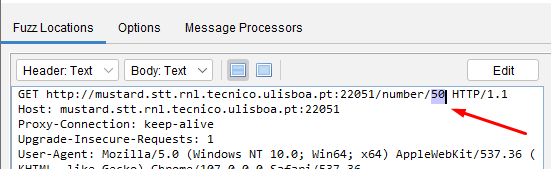

# Lab 1 - Introduction

The goal of this class is to setup the course's laboratory environment and learn how to interact with a server using ZAP and `requests` Python module.  

Don't forget that in order to access our servers you need to be either:

- Working on an RNL Lab computer,
- Connected to Técnico [VPN](README.md#2-connect-to-t%C3%A9cnico-vpn) on the VM, or
- Connected to Técnico [VPN](README.md#2-connect-to-t%C3%A9cnico-vpn) on the host system.

## 1. Class outline

[Start by reading this page,](README.md) which explains some of the following steps in greater detail.

1. [Download and set up our Virtual Machine](README.md#1-virtual-machine)
2. [Connect to Técnico VPN](README.md#2-connect-to-t%C3%A9cnico-vpn)
3. [Register yourself in our scoreboard](README.md#3-scoreboard)
4. Log into your scoreboard account and go to the Challenges section
5. Start solving the challenges!

## 2. Introduction to Zap

We will start by using challenge `Guess a Number` to illustrate the usage of the Web Scanner Zap.

Zap is an open-source Web Application Scanner used to perform web security testing. ZAP is a versatile and extensible tool, but its main feature is acting as a man-in-the-middle between a browser and a web server, allowing you to record, inspect and modify the exchanges that happen between the two.

[The official website](https://www.zaproxy.org/) has extensive information on how to use Zap. In the next sections we will cover some of the basics of ZAP.

More resources on ZAP:

- [homepage](https://www.zaproxy.org/)
- [quick start guide](https://www.zaproxy.org/getting-started/)
- [Introduction videos](https://www.zaproxy.org/zap-in-ten/)

### Analyzing Web Requests in Zap

To start analyzing requests, do the following steps:

1. Start Zap
2. Select _Manual Explore_ in the Quick Start tab
3. Write the URL you want to analyze and click _Launch Browser_
4. When the integrated browser opens up, a new line will appear in Zap in the _History_ tab below. This line corresponds to your request to access the URL you provided.

    

5. If you click it, you can see the _Request_ and _Response_ in the tabs above

    

6. Any requests that you perform in the Zap-associated browser will be recorded by Zap, and saved in the _History_ tab.
7. It might also be useful to apply some _Filters_, to avoid having the History tab with all browser requests.

    

### Fuzzing with Zap

If we open the challenge `Guess a Number`, we see that to guess the correct number out of 1000 we would need to spend significant time testing every single number until we find the correct one. This is called _brute-forcing_ and the _Zap Fuzzing tool_ can do it automatically for us.

The ZAP Fuzzing Tool works as follows:

1. Right click the request you want to brute-force (the one to the endpoint `/number/guess`) and select _Attack > Fuzz_

2. Select the part of the request you want to Fuzz

    

3. Click _Add_ once (to add a fuzzing position), and _Add_ again (to select the payloads that will be used to fuzz that position). Then select _Numberzz_ as the type of payload and, in our case, we want to send all numbers from 0 to 1000.

    

4. Start the Fuzzer. Zap will open up a Fuzz tab showing a line for each request performed by the Fuzzer. When we apply fuzzing, we aim at finding which payloads correspond to outliers. These outliers are usually, Response Code, Time of Response, Size of Response, etc. In our challenge, the outlier might be in the size of the response.

    You could just order the outputs by size, or, alternatively, use the search tool to search for the beginning of the flag `SSof`.

    

### More on ZAP

ZAP provides more information than the one we explained above. Take some time to explore ZAP:

- Observe that sites get mapped out on the left pane
- Explore the UI
  - Check out the Request and Response tabs for the HTTP request and response data
  - Look at the security alerts

## 3. Using Python Requests

During the course you will need to interact with HTTP servers and a good way to do it is using the `requests` Python module. To illustrate the usage of Python requests, we will use challenge `Guess a BIG Number`.

`requests` is an elegant and simple HTTP library for Python that allows to perform HTTP requests extremely easily. You can find documentation for `requests` [here](https://requests.readthedocs.io/en/latest/).

This module is already installed in our VMs, but you can install it on your system running in the terminal:

    pip install requests (or pip3 install requests)

You can see [here](./code/requests_template.py) a template on how to use Python Requests.

Try to solve the challenge `Guess a BIG Number` using Python Requests. You should aim at a clever solution. **Don't brute-force every possible number!**

_Hint 1:_ When your guess is wrong, the system provides you with some relevant information. How can it be useful?

_Hint 2:_ To solve the first challenge `Guess a Number` using Python Requests (instead of ZAP) we can use the following code:

```python
import requests

link = "http://mustard.stt.rnl.tecnico.ulisboa.pt:22051"

# Create a session to persist the cookies between requests
s = requests.Session()

# Access the first link to set the user cookie
s.get(link)

for i in range(1000):
    response = s.get(link + "/number/" + str(i))

    if ("SSof" in response.text):
        print(response.text)
        break
```
