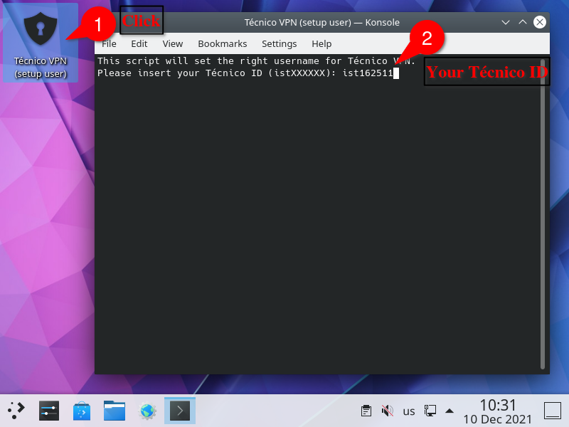
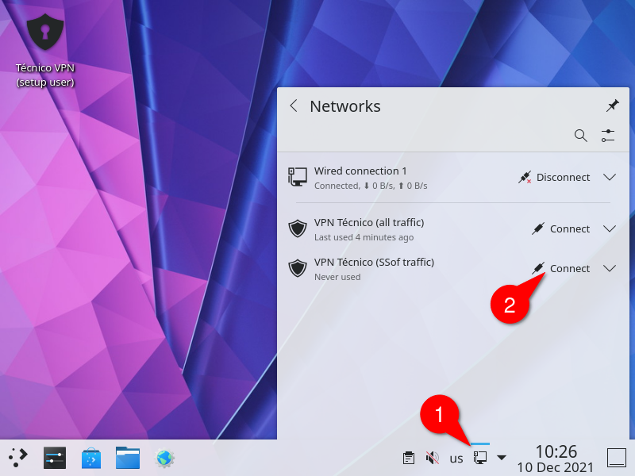
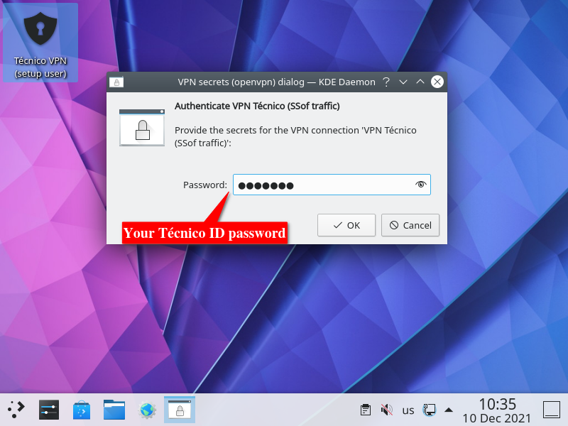

# VM

[Please read the Virtual Machine section in README.md first.](README.md#1-virtual-machine)

Our virtual machine is an installation of Debian GNU/Linux 11, amd64 architecture with i386 foreign architecture. (Aka. x86_64 and x86, respectively)

The download size is currently about 3 GiB and the freshly installed size in VirtualBox is about 8 GiB.
The virtual disk can grow up to 30 GiB.

Check [README](README.md#1-virtual-machine) for download links.

## 1. Importing an OVA file in Virtual Box or VMware Fusion, on your machine

- How [to import an existing VM into VirtualBox](https://docs.oracle.com/cd/E26217_01/E26796/html/qs-import-vm.html)

In short:

1. Download the latest VM image
2. Open VirtualBox
3. File > Import Appliance...
4. Find the file you downloaded
5. Optionally: add more RAM and CPUs (depending on your computer's resources)
6. Finish importing and run the VM!


- How [to import an existing VM into VMware Fusion](https://pubs.vmware.com/fusion-5/index.jsp?topic=%2Fcom.vmware.fusion.help.doc%2FGUID-275EF202-CF74-43BF-A9E9-351488E16030.html)

Our VM image *should* work on VMware, but currently only VirtualBox has been tested and is recommended.

## 2. Login details for the VM

If you intend to use the VM for purposes other than our lab challenges, we urge you to change these credentials.

    user: ssof
    passwd: ssof

    root password: root

Note: the user `ssof` can use `sudo` without password.  
Remove `/etc/sudoers.d/ssof_nopass` to disable this.

## 3. Installed Tools

### Web

- Firefox (ESR)
- Chromium (FOSS version of Google Chrome)
- curl
- Python module `requests`
- OWASP Zed Attack Proxy (ZAP)

### Reverse and pwn

<!-- - IDA freeware -->
<!-- - radare2 -->
<!-- - Cutter (radare2 GUI) -->
- gdb
- PEDA (gdb plugin, available as gdb-peda command)
- pwndbg (gdb plugin, included but not installed, see below)
- python module `pwntools`
- ROPGadget

#### pwndbg

pwndbg has a messy installation script and for this reason has been left uninstalled.

If you wish to use it, you can finish installing it by running:

```bash
cd /opt/pwndbg/pwndbg-2021.06.22/
./setup.sh
```

After this when you start `gdb` it will load pwndbg automatically.
There's no uninstallation method, but you can stop it from loading with `gdb` by editing the `~/.gdbinit` file.

### Other

- text editors: vim, neovim, emacs, kate
- git
- python, python-pip, Spyder (Python IDE), IDLE (Python IDE)
- snap package manager
- TODO: list others
- KDE Desktop Environment
  - Including some extraneous packages that we'd probably be fine without
  - TODO: cut down on unnecessary packages

### Installing more software

- All of Debian 11 is available via `apt`
- Snap packages can be installed, for example:
- If you want Visual Studio Code, you can install vscodium with this command:
  - `sudo snap install --classic codium`


## 4. Running a VM using `rnl-virt` in RNL (labs in Alameda)

1. If the computer is running Windows, reboot it and choose RNL Linux
2. Log in
3. Run the commands below

```bash
# Create a directory on /tmp and change into it
mkdir /tmp/ssof_vm
cd /tmp/ssof_vm

# Download current version of VM (update URL if necessary)
wget -O ssof_vm.ova https://drive.tecnico.ulisboa.pt/download/1695923672919286

# Extract the OVA file
tar -xf ssof_vm.ova

# Convert the compressed VMDK disk into QCOW2 format
qemu-img convert -O qcow2 ssof_vm-disk001.vmdk ssof_vm.qcow2

# Create a new rnl-virt VM named "ssof" using built-in template "SSOF" and disk "ssof_vm.qcow2"
# --nat is required for Internet access
rnl-virt vm create ssof SSOF ssof_vm.qcow2 --nat

# Boots the VM in the background
rnl-virt vm start ssof

# Opens a window to the running VM
rnl-virt vm open ssof
```

It's important to use a directory in /tmp or on a removable drive, since your home directory lives in a network filesystem (AFS), which is relatively slow and you can easily exceed your default 10GiB quota.

## 5. Running a VM in labs in Tagus

(We assume you're on Linux)

1. Download the latest VM image to `/vms`: ```wget -O /vms/ssof_vm.ova https://drive.tecnico.ulisboa.pt/download/1695923672919286```
2. Open VirtualBox
3. File > Import Appliance...
4. Find the file you downloaded in /vms
5. Change the "Machine Base Folder" to be somewhere in /vms (the default is in your home, which is not a good idea, since it's on AFS)
6. Optionally, add more RAM and CPUs (depending on Lab computer resources)
7. Finish importing and run the VM!

## 6. Connecting to Técnico VPN from our Virtual Machine

1. Click the icon in the desktop (1) and insert your Técnico ID (2)



2. Click the icon in the notification area (1) and click "Connect" on
   one of the preconfigured VPN connections. (2)



3. Insert your Técnico ID password



## 7. Known bugs and workarounds

- VM fails to start with the following error: `Cannot enable nested VT-x/AMD-V (...)`
  - In the VM Settings, go to System > Processor and uncheck "Enable Nested VT-x/AMD-v".
- The CapsLock key doesn't work (it's an additional Control key). Workarounds:
  - Use the shift key
  - `sudo sed -i 's/ctrl:nocaps,//' /etc/default/keyboard` then restart
- ZAP doesn't have a menu entry
  - Run `zaproxy` in the terminal
- There is no swap (and the default 2GiB RAM is small)
  - Add more RAM to the VM in the VM settings
  - Create a swap file. Here's how, for a 2 GiB swap file:
```bash
sudo -i # run the following commands as root
fallocate -l 2GiB /swapfile
chmod 700 /swapfile
mkswap /swapfile
swapon /swapfile
echo "/swapfile none swap sw,nofail 0 0" >> /etc/fstab
```
- Screensaver locks screen, requiring password (it's "ssof")
  - Disable in KDE settings (Workspace > Workspace Behavious > Screen Locking)
- Missing some integration with rnl-virt, like automatic guest screen resizing and clipboard sync

## 8. Changelog

### 2021-12-05
Initial release of new SSof VM image.

### 2021-12-10
- ZAP installed manually instead of using snap. Fixes being unable to start a browser from it.
- Disable KDE Wallet. Prevents a confusing prompt from appearing when first configuring the VPN.
- Add chromium
- No longer fully installs pwndbg, to avoid running its messy install script.
- Set new defaults apps: Firefox for HTML, Spyder for Python scripts
- Fix problem with the all-traffic variant of VPN connection


## 9. Older versions

ssof_vm.2021-12-10.ova: [Técnico Drive](https://drive.tecnico.ulisboa.pt/download/1695923672919286) [Google Drive](https://drive.google.com/file/d/1OlfETUT0dYSxuycckY9L2NpLLEcAnoXx/view)
ssof_vm.2021-12-05.ova: [Técnico Drive](https://drive.tecnico.ulisboa.pt/download/1695923672918739) [Google Drive](https://drive.google.com/file/d/1zUrU4OusnnzDZ80i3fg8SsP-3sREdDLN/view)

Hashes:

    # SHA512
    SHA512 (ssof_vm.2021-12-10.ova) = c36ef519eaa1778627708e7f3badb0de3cbd3a3df3a7991189cf448a1cc70698df0287ca89c5516997c82675a5e1aad8972f3a9fa84cbc4afae1cf6a8676de7d
    SHA512 (ssof_vm.2021-12-05.ova) = 489d6985c1bf42af10510bb22b26a93deca2bb587caa94d68c0877a2c1bf58eed1ce027d58ceda1ab8d823ba7965f9320a146f107e8997038f9de9254e4a17ed
    # SHA1
    SHA1SUM (ssof_vm.2021-12-10.ova) = 909b9e47c4eeae92041332cb37d3a5c8ded0dcd3
    SHA1SUM (ssof_vm.2021-12-05.ova) = a1d2fb9d4f206e77bb42ff54e208e534dcffaa65
